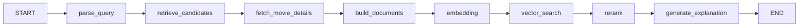

<div align="center" style="background: radial-gradient(circle at 20% 0%, rgba(185,28,28,0.22), transparent 42%), linear-gradient(180deg, #0a0506 0%, #14090b 100%); border: 1px solid rgba(185,28,28,0.35); border-radius: 24px; padding: 52px 28px 40px; color: #f6eded;">
  
  <h1 style="margin: 22px 0 6px; font-size: 52px; line-height: 1; letter-spacing: -2px; font-weight: 900; color: #f6eded;">
    Cine<span style="color: #b91c1c;">Mind</span>
  </h1>
  <p style="margin: 0; color: #b09696; font-size: 16px; letter-spacing: 0.18em; text-transform: uppercase; font-weight: 700;">
    AI Movie Discovery &amp; Similar-Film Search
  </p>
  <p style="margin: 22px 0 0; font-size: 14px;">
    <span style="display:inline-block; background:#170a0c; color:#b91c1c; border:1px solid rgba(185,28,28,0.55); padding:7px 16px; border-radius:999px; font-weight:800;">Next.js 16</span>
    <span style="display:inline-block; background:#170a0c; color:#f6eded; border:1px solid rgba(255,255,255,0.16); padding:7px 16px; border-radius:999px; font-weight:800; margin-left:8px;">TMDB</span>
    <span style="display:inline-block; background:#170a0c; color:#f6eded; border:1px solid rgba(255,255,255,0.16); padding:7px 16px; border-radius:999px; font-weight:800; margin-left:8px;">LangGraph</span>
    <span style="display:inline-block; background:#170a0c; color:#f6eded; border:1px solid rgba(255,255,255,0.16); padding:7px 16px; border-radius:999px; font-weight:800; margin-left:8px;">Neon pgvector</span>
    <span style="display:inline-block; background:#170a0c; color:#f6eded; border:1px solid rgba(255,255,255,0.16); padding:7px 16px; border-radius:999px; font-weight:800; margin-left:8px;">SiliconFlow</span>
  </p>
  <p style="margin-top: 26px; font-size: 14px;">
    <strong style="color:#f6eded;">English</strong> ·
    <a href="README.zh-CN.md" style="color:#b91c1c; font-weight:700; text-decoration:none;">中文</a>
  </p>
</div>

<p align="center" style="color:#b09696;">
  Pick 1-5 movies you love. AI finds the ones you will love next.
</p>

## Demo Video

Watch the demo on Bilibili: [【我做了一个“以电影找电影”的 AI 推荐系统】](https://www.bilibili.com/video/BV1uF8Z6WEbi/)

## What is CineMind

CineMind is a cinematic movie database and AI discovery platform. Instead of forcing users to write a natural-language prompt, you simply **select one or more films** you have watched or enjoyed. The system analyzes their shared genres, keywords, atmosphere, and production countries, retrieves candidates from TMDB, builds semantic documents, embeds them, and returns ranked recommendations with a clear explanation for every pick.

## Highlights

- **Movie Library Experience** — home feeds, search, movie detail pages, cast, keywords, trailers, certifications, and similar films.
- **Pick to Discover** — choose 1-5 films and let AI recommend based on shared points instead of writing a prompt.
- **Precise Filters** — browse with genre, year range, language, certification, minimum rating, and multiple sort modes.
- **LangGraph Pipeline** — query understanding, candidate retrieval, detail fetching, document building, embedding, vector search, reranking, and explanation generation.
- **Temporary Semantic Index** — Neon + pgvector stores only the movies used in AI search with a 24-hour TTL; it is not a full TMDB mirror.
- **Watchlist** — save films to a Neon-backed watchlist without touching the AI embedding pipeline.
- **Provider Flexible** — works with OpenAI or SiliconFlow for chat and embeddings, with graceful local fallbacks.

## Core Flow



## Tech Stack

| Layer | Choice |
| --- | --- |
| Frontend | Next.js 16, TypeScript, Tailwind CSS |
| Orchestration | LangGraph |
| Movie Data | TMDB API |
| LLM / Embedding | OpenAI or SiliconFlow |
| Vector Store | PostgreSQL + pgvector on Neon |
| Icons | lucide-react |

## Quick Start

```bash
npm install
cp .env.example .env.local
npm run dev
```

Without API keys the app runs in demo mode with built-in movie data, so every flow can be explored immediately.

## Environment Variables

| Variable | Purpose |
| --- | --- |
| `TMDB_API_KEY` / `TMDB_ACCESS_TOKEN` | TMDB movie data |
| `TMDB_API_BASE_URL` | Optional mirror or reverse proxy for TMDB |
| `TMDB_PROXY` / `HTTPS_PROXY` | Optional proxy when TMDB is unreachable |
| `OPENAI_API_KEY` | OpenAI chat + embeddings |
| `SILICONFLOW_API_KEY` | SiliconFlow chat + embeddings |
| `AI_PROVIDER` | `auto`, `openai`, or `siliconflow` |
| `EMBEDDING_MODEL` / `SILICONFLOW_EMBEDDING_MODEL` | Embedding model |
| `EMBEDDING_DIMENSIONS` | Vector dimensions used by pgvector |
| `DATABASE_URL` | Neon PostgreSQL connection string |
| `WATCHLIST_USER_KEY` | Single-user watchlist key, defaults to `default` |

## API

| Method | Endpoint | Description |
| --- | --- | --- |
| `GET` | `/api/movies/search?q=` | Search movies |
| `GET` | `/api/movies/browse` | Filtered browse with pagination |
| `GET` | `/api/movies/:tmdbId` | Movie details |
| `POST` | `/api/ai-search` | AI recommendations from `movie_ids` |
| `GET/POST` | `/api/watchlist` | Read or add watchlist items |
| `DELETE` | `/api/watchlist/:tmdbId` | Remove from watchlist |

## Neon + pgvector

1. Create a free Neon PostgreSQL database.
2. Execute `db/schema.sql` in Neon SQL Editor.
3. Set `DATABASE_URL` and `PGVECTOR_ENABLED=true`.
4. Clean expired AI cache with `scripts/cleanup-cache.sql` on a schedule.

`movie_search_cache` is a temporary AI-only index. `user_watchlist` is user data and is never read by the AI embedding pipeline.

## Deployment

The project is designed for Vercel. Add the environment variables above, deploy the Next.js app, and point the serverless functions at Neon. API keys stay on the server and are never exposed to the browser.
