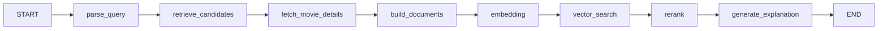

# CineMind

CineMind 是一个 AI 驱动的电影搜索与发现平台。它像 IMDb / 豆瓣一样提供电影浏览，但核心搜索入口是自然语言：用户描述氛围、题材、情绪与参考电影，系统用 LLM 理解需求，从 TMDB 获取候选电影，再通过电影剧情、类型、关键词、导演和演员构建语义文档，用 PostgreSQL + pgvector 做混合检索，最后为每部推荐电影生成解释。

## 核心能力

- 首页：热门 / 高分 / 最近上映电影，深色电影数据库风格，响应式卡片网格。
- 浏览页：`/browse` 按类型、年份、语言、分级、最低评分和排序筛选电影，支持分页加载更多。
- 普通搜索：`/api/movies/search` 直接调用 TMDB，点击进入 `/movies/[tmdbId]` 详情页。
- 待看电影：详情页点击“想看”后保存到 Neon `user_watchlist` 表，可在 `/watchlist` 查看和移除。
- 电影详情：海报、背景图、中文名、原名、年份、类型、时长、地区、分级、评分、IMDb 链接、剧情、导演、编剧、演员、关键词、Trailer、相似电影。
- 选电影找相似：在 `/ai-search` 选择 1-5 部电影，`/api/ai-search` 使用 LangGraph 分析共同类型、关键词和氛围，再编排候选检索、详情获取、Embedding、pgvector 检索、rerank 和推荐解释。
- 临时语义索引：只缓存 AI 搜索过程中需要的电影，`expires_at` 默认 24 小时，每次 AI 搜索自动清理过期数据。

## 技术栈

- Next.js 16 + TypeScript + Tailwind CSS
- LangGraph（AI 搜索状态图）
- TMDB API（电影事实数据）
- OpenAI / SiliconFlow（Query Understanding / Embedding / 推荐解释，可选）
- PostgreSQL + pgvector（临时向量缓存，可选）
- lucide-react（图标）

## 快速开始

```bash
npm install
cp .env.example .env.local
npm run dev
```

没有配置任何 Key 时，应用会运行在演示模式：使用内置的 20 部电影数据完成普通搜索、详情页和 AI 搜索闭环。配置 Key 后会切换到真实数据。

## 环境变量

```env
TMDB_API_KEY=你的 TMDB v3 API Key
TMDB_ACCESS_TOKEN=或者使用 v4 Bearer Token
TMDB_LANGUAGE=zh-CN

OPENAI_API_KEY=你的 OpenAI Key
OPENAI_BASE_URL=可选，默认 https://api.openai.com/v1
OPENAI_MODEL=gpt-4o-mini
EMBEDDING_MODEL=text-embedding-3-small

SILICONFLOW_API_KEY=你的硅基流动 API Key
SILICONFLOW_BASE_URL=https://api.siliconflow.cn/v1
SILICONFLOW_MODEL=deepseek-ai/DeepSeek-V3
SILICONFLOW_EMBEDDING_MODEL=BAAI/bge-m3

AI_PROVIDER=auto
EMBEDDING_DIMENSIONS=1024

DATABASE_URL=Neon PostgreSQL 连接串
PGVECTOR_ENABLED=true

AI_SEARCH_TOP_K=10
AI_SEARCH_TTL_HOURS=24
```

如果没有配置任何 LLM / Embedding Key，系统会自动使用本地查询解析、本地哈希 Embedding 和模板推荐解释；如果没有 `DATABASE_URL`，则使用带 TTL 的内存向量缓存。

## SiliconFlow（硅基流动）

硅基流动提供 OpenAI 兼容接口，直接在 `.env.local` 中配置即可：

```env
AI_PROVIDER=siliconflow
SILICONFLOW_API_KEY=sk-...
SILICONFLOW_MODEL=deepseek-ai/DeepSeek-V3
SILICONFLOW_EMBEDDING_MODEL=BAAI/bge-m3
EMBEDDING_DIMENSIONS=1024
```

`AI_PROVIDER` 可选值：

- `auto`：存在 `SILICONFLOW_API_KEY` 时优先使用硅基流动，否则使用 OpenAI。
- `siliconflow`：强制使用硅基流动。
- `openai`：强制使用 OpenAI。

`BAAI/bge-m3` 的向量维度是 1024。切换 Embedding 模型时，需要把 `EMBEDDING_DIMENSIONS` 设置为模型实际维度，并保证 pgvector 表字段维度一致；如果你在 Neon 中已创建过 1536 维表，需要重建 `movie_search_cache` 表或改用同维度的 Embedding 模型。

## TMDB 网络被阻断时

如果 `api.themoviedb.org` 请求超时（例如 `ConnectTimeoutError`），说明当前网络无法直接访问 TMDB API，此时可以：

代码默认会自动尝试备用域名 `api.tmdb.org`；如果这个域名可用，通常不需要额外配置。只有两个域名都不可达时，才需要代理或镜像：

```env
# 使用本地代理，例如 Clash / Surge 的 HTTP 代理
TMDB_PROXY=http://127.0.0.1:7890
HTTPS_PROXY=http://127.0.0.1:7890
```

或者把 TMDB API 地址指向自己的反向代理 / 镜像：

```env
TMDB_API_BASE_URL=https://your-proxy.example.com/3
```

配置后重启 `npm run dev`。代码里只有在配置了 `TMDB_PROXY` 或 `HTTPS_PROXY` 时才会走代理，不影响硅基流动等其他 API。

如果 Neon 数据库连接也经常超时，可以先关闭 pgvector，让系统使用内存向量缓存：

```env
PGVECTOR_ENABLED=false
```

开启后 AI 搜索仍可完整运行，只是临时索引不会持久化到数据库。

## Neon + pgvector

1. 在 [Neon](https://neon.tech) 创建免费 PostgreSQL 数据库。
2. 在 Neon SQL Editor 中执行 `db/schema.sql`。
3. 设置 `DATABASE_URL` 和 `PGVECTOR_ENABLED=true`。
4. 定期清理过期数据：可执行 `scripts/cleanup-cache.sql`，或把相同 SQL 放进 Neon 定时任务 / cron。

`movie_search_cache` 只保存 AI 搜索用到的临时电影，不镜像整个 TMDB。Embedding 维度由 `EMBEDDING_DIMENSIONS` 控制：OpenAI `text-embedding-3-small` 为 1536，SiliconFlow `BAAI/bge-m3` 为 1024。

## API

```text
GET  /api/movies/search?q=Inception
GET  /api/movies/browse?genres=恐怖,惊悚&year_min=1990&year_max=2010&languages=en&certifications=R&min_rating=7&sort_by=vote_average.desc&page=1
GET  /api/movies/:tmdbId
POST /api/ai-search
GET  /api/watchlist
POST /api/watchlist
GET  /api/watchlist/status?tmdb_id=27205
DELETE /api/watchlist/:tmdbId
```

`user_watchlist` 是独立的用户数据表，只用于待看列表；AI 搜索的 Embedding 和候选检索不会读取这张表，`movie_search_cache` 仍然是 AI 搜索专用的临时语义索引。

待看列表只写入 Neon，不使用浏览器本地存储。Neon 不可达时接口会返回错误，详情页和列表页会提示“连接不到数据库”。

选电影找相似请求体：

```json
{
  "movie_ids": [44214, 4553],
  "filters": {
    "genres": ["悬疑", "惊悚"],
    "year_min": 2000,
    "year_max": 2010,
    "languages": ["en"],
    "certifications": ["R"]
  },
  "notes": "喜欢压抑、慢节奏、主角逐渐心理崩溃，结局不要大团圆"
}
```

`filters` 全部可选：类型、年份、语言、分级会先过滤候选影片，再进入 Embedding 和数据库缓存；`notes` 会被解析成情绪 / 风格 / 主题，并写入语义查询文本，用于从已 Embedding 的候选中做更精确的排序。

响应包含 `results[]`、结构化共同点、LangGraph `trace`、数据模式和向量存储类型。旧的 `query` 自然语言方式仍然兼容：

```json
{
  "query": "找一些类似《黑天鹅》的电影，但是更加疯狂、压抑和实验性"
}
```

## LangGraph 流程



## 部署到 Vercel

1. 将代码推送到 GitHub。
2. 在 Vercel 创建项目并选择 Next.js 框架预设。
3. 配置 `.env` 中的变量。
4. 部署后使用 Neon 数据库连接串完成 pgvector 配置。

服务端 API Route 不会把 TMDB Key 或 OpenAI Key 暴露到浏览器。海报与背景图只保存 TMDB 图片路径，由前端按 `https://image.tmdb.org/t/p/...` 加载。
