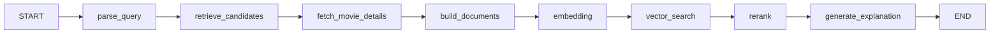

<div align="center" style="background: radial-gradient(circle at 20% 0%, rgba(185,28,28,0.22), transparent 42%), linear-gradient(180deg, #0a0506 0%, #14090b 100%); border: 1px solid rgba(185,28,28,0.35); border-radius: 24px; padding: 52px 28px 40px; color: #f6eded;">
  
  <h1 style="margin: 22px 0 6px; font-size: 52px; line-height: 1; letter-spacing: -2px; font-weight: 900; color: #f6eded;">
    Cine<span style="color: #b91c1c;">Mind</span>
  </h1>
  <p style="margin: 0; color: #b09696; font-size: 16px; letter-spacing: 0.18em; text-transform: uppercase; font-weight: 700;">
    AI 电影发现与相似影片搜索
  </p>
  <p style="margin: 22px 0 0; font-size: 14px;">
    <span style="display:inline-block; background:#170a0c; color:#b91c1c; border:1px solid rgba(185,28,28,0.55); padding:7px 16px; border-radius:999px; font-weight:800;">Next.js 16</span>
    <span style="display:inline-block; background:#170a0c; color:#f6eded; border:1px solid rgba(255,255,255,0.16); padding:7px 16px; border-radius:999px; font-weight:800; margin-left:8px;">TMDB</span>
    <span style="display:inline-block; background:#170a0c; color:#f6eded; border:1px solid rgba(255,255,255,0.16); padding:7px 16px; border-radius:999px; font-weight:800; margin-left:8px;">LangGraph</span>
    <span style="display:inline-block; background:#170a0c; color:#f6eded; border:1px solid rgba(255,255,255,0.16); padding:7px 16px; border-radius:999px; font-weight:800; margin-left:8px;">Neon pgvector</span>
    <span style="display:inline-block; background:#170a0c; color:#f6eded; border:1px solid rgba(255,255,255,0.16); padding:7px 16px; border-radius:999px; font-weight:800; margin-left:8px;">硅基流动</span>
  </p>
  <p style="margin-top: 26px; font-size: 14px;">
    <a href="README.md" style="color:#b91c1c; font-weight:700; text-decoration:none;">English</a> ·
    <strong style="color:#f6eded;">中文</strong>
  </p>
</div>

<p align="center" style="color:#b09696;">
  选择 1-5 部你喜欢的电影，AI 会找到你下一部想看的电影。
</p>

## 项目定位

CineMind 是一个电影数据库与 AI 发现平台。用户不需要写自然语言搜索词，只需要**选择 1-5 部看过的电影**。系统会分析这些电影共同的类型、关键词、氛围和制片地区，从 TMDB 获取候选，构建语义文档并生成 Embedding，最终返回排序后的推荐结果，并为每部电影解释推荐原因。

## 核心能力

- **电影数据库体验**：首页、搜索、详情页、演职员、关键词、预告片、分级、相似电影。
- **选片发现**：选择 1-5 部电影，AI 根据共同点推荐，而不是输入自然语言。
- **精确筛选**：类型、年份、语言、分级、最低评分、多种排序方式，支持页码浏览。
- **LangGraph 流水线**：查询理解、候选检索、详情获取、文档构建、Embedding、向量搜索、重排和推荐解释。
- **临时语义索引**：Neon + pgvector 只保存 AI 搜索使用过的电影，默认 24 小时 TTL，不镜像整个 TMDB。
- **待看列表**：保存到 Neon，不影响 AI 搜索的 Embedding 流程。
- **多模型支持**：兼容 OpenAI 和硅基流动，同时保留本地降级能力。

## 核心流程



## 技术栈

| 层级 | 选择 |
| --- | --- |
| 前端 | Next.js 16、TypeScript、Tailwind CSS |
| 流程编排 | LangGraph |
| 电影数据 | TMDB API |
| LLM / Embedding | OpenAI 或硅基流动 |
| 向量存储 | Neon PostgreSQL + pgvector |
| 图标 | lucide-react |

## 快速开始

```bash
npm install
cp .env.example .env.local
npm run dev
```

未配置 API Key 时，应用会使用内置演示数据运行，所有核心流程都可以直接体验。

## 环境变量

| 变量 | 用途 |
| --- | --- |
| `TMDB_API_KEY` / `TMDB_ACCESS_TOKEN` | TMDB 电影数据 |
| `TMDB_API_BASE_URL` | 可选的 TMDB 镜像或反向代理 |
| `TMDB_PROXY` / `HTTPS_PROXY` | TMDB 不可达时的代理 |
| `OPENAI_API_KEY` | OpenAI 对话与 Embedding |
| `SILICONFLOW_API_KEY` | 硅基流动对话与 Embedding |
| `AI_PROVIDER` | `auto`、`openai` 或 `siliconflow` |
| `EMBEDDING_MODEL` / `SILICONFLOW_EMBEDDING_MODEL` | Embedding 模型 |
| `EMBEDDING_DIMENSIONS` | pgvector 向量维度 |
| `DATABASE_URL` | Neon PostgreSQL 连接串 |
| `WATCHLIST_USER_KEY` | 单用户待看列表 key，默认为 `default` |

## API

| 方法 | 接口 | 说明 |
| --- | --- | --- |
| `GET` | `/api/movies/search?q=` | 搜索电影 |
| `GET` | `/api/movies/browse` | 带筛选和分页浏览 |
| `GET` | `/api/movies/:tmdbId` | 电影详情 |
| `POST` | `/api/ai-search` | 根据 `movie_ids` 生成 AI 推荐 |
| `GET/POST` | `/api/watchlist` | 读取或添加待看列表 |
| `DELETE` | `/api/watchlist/:tmdbId` | 移除待看 |

## Neon + pgvector

1. 创建 Neon 免费 PostgreSQL 数据库。
2. 在 Neon SQL Editor 中执行 `db/schema.sql`。
3. 设置 `DATABASE_URL` 和 `PGVECTOR_ENABLED=true`。
4. 使用 `scripts/cleanup-cache.sql` 定期清理过期 AI 缓存。

`movie_search_cache` 是 AI 专用的临时索引；`user_watchlist` 是用户数据，AI 的 Embedding 流程不会读取它。

## 部署

项目面向 Vercel 部署。配置环境变量后部署 Next.js 应用，并让 Serverless Function 连接 Neon。所有 API Key 都只存在于服务端，不会暴露到浏览器。
